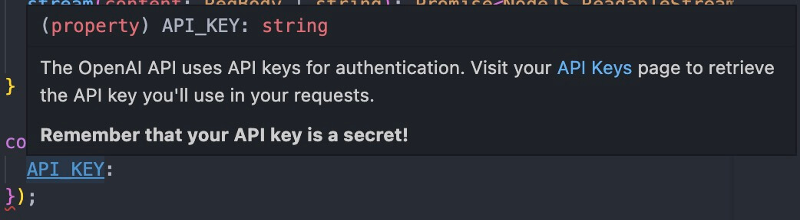
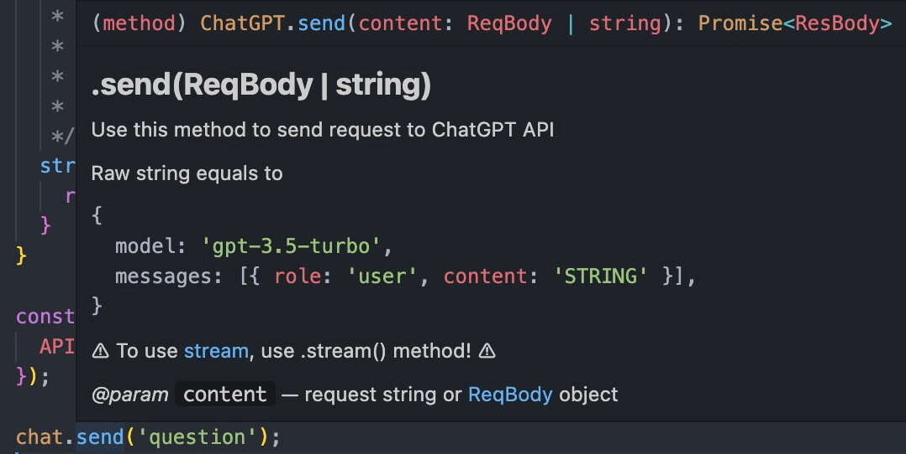
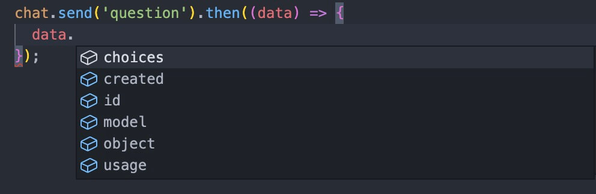

[](https://www.npmjs.com/package/chatgpt-wrapper) [](https://github.com/TABmk/chatgpt-wrapper/blob/master/LICENSE) 


__Help__ [](https://github.com/TABmk/chatgpt-wrapper/issues?q=is%3Aopen+is%3Aissue) [](https://github.com/TABmk/chatgpt-wrapper/pulls?q=is%3Aopen+is%3Apr)

#### __Rate me__ [](https://github.com/TABmk/chatgpt-wrapper)

# __ChatGPT-wrapper__

### __[ChatGPT](https://openai.com/blog/chatgpt/) [API](https://platform.openai.com/docs/api-reference/chat) wrapper__

Official docs - https://platform.openai.com/docs/api-reference/chat
<p align="center">



</p>

## Features
- types included
- docs included
- [Stream](https://platform.openai.com/docs/api-reference/chat/create#chat/create-stream) included

## Install
`npm i chatgpt-wrapper` 

  or

`yarn add chatgpt-wrapper`

## Usage
### Import
#### CommonJS

`const { ChatGPT } = require('chatgpt-wrapper');`

#### Modules
`import { ChatGPT } from 'chatgpt-wrapper';`

with Types

`import { ChatGPT, Message, ReqBody, ResBody } from 'chatgpt-wrapper';`

### New instance

Visit your [API Keys](https://platform.openai.com/account/api-keys) page to retrieve the API key

``` javascript
const chat = new ChatGPT({
  API_KEY: '...', // Your API KEY (Required)
  ORG: '...',     // Your organization (Optional)
  URL: '...',     // API endpoint (Optional)
});
```

### Error Handling

Do not forget to catch errors from your requests since OpenAI API sometimes returns error message instead of response.

"[API error](https://github.com/TABmk/chatgpt-wrapper/blob/master/index.ts#L266)" errors returns [APIError](https://github.com/TABmk/chatgpt-wrapper/blob/master/index.ts#L195) type.

#### async/await
``` javascript
try {
  const answer = chat.send('question');
  // ...
} catch (err) {
  // handle error
}
```

#### Promise
``` javascript
chat.send('question')
  .then((answer) => { /* ... */ })
  .catch((err) => { /* handle error */ });
```

## Methods

## send(content: ReqBody | string): Promise\<ResBody>

Use this method to send request to ChatGPT API

Raw string equals to
``` javascript
{
  model: 'gpt-3.5-turbo',
  messages: [{
    role: 'user',
    content: 'YOUR STRING',
  }],
}
```

⚠️ To use stream option, use .stream() method! ⚠️

Examples:
``` javascript
const answer = await chat.send('what is JavaScript');

console.log(answer.choices[0].message);
```
``` javascript
chat.send('what is JavaScript').then((answer) => {
  console.log(answer.choices[0].message);
});
```
``` javascript
const answer = await chat.send({
  model: 'gpt-3.5-turbo-0301',
  messages: [{
    role: 'user',
    content: 'what is JavaScript',
  }],
  max_tokens: 200,
});

console.log(answer.choices[0].message);
```

## stream(content: ReqBody | string): Promise<NodeJS.ReadableStream>

Use this method to send request to ChatGPT API and get steam response back

Raw string equals to
``` javascript
{
  model: 'gpt-3.5-turbo',
  stream: true,
  messages: [{
    role: 'user',
    content: 'YOUR STRING',
  }],
}
```

Examples:
``` javascript
(async () => {
  const answer = await chat.stream('what is JavaScript in 200 words');

  answer.pipe(process.stdout);
})();
```

## Types

### Message

Message in [chat format](https://platform.openai.com/docs/guides/chat/introduction)

Source: [index.ts#L4](https://github.com/TABmk/chatgpt-wrapper/blob/master/index.ts#L4)

### ReqBody

Request body

Source: [index.ts#L21](https://github.com/TABmk/chatgpt-wrapper/blob/master/index.ts#L21)

### ResBody

Response body

Source: [index.ts#L120](https://github.com/TABmk/chatgpt-wrapper/blob/master/index.ts#L120)

### APIError

OpenAI API error

Source: [index.ts#L195](https://github.com/TABmk/chatgpt-wrapper/blob/master/index.ts#L195)

